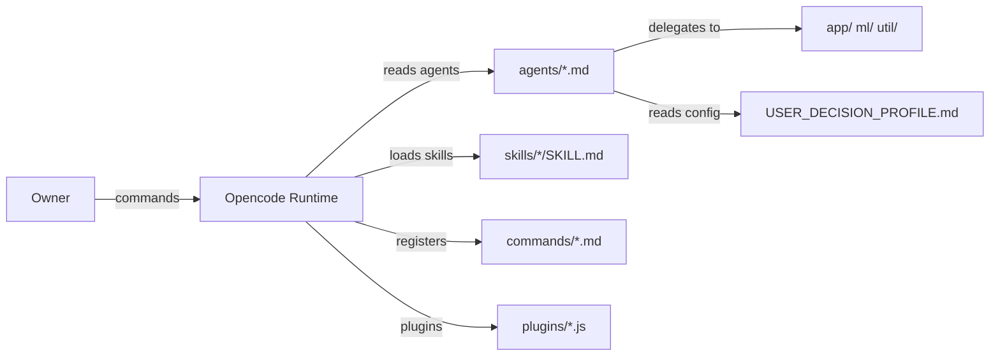

# Codebase Overview

> Personal configuration hub for the Opencode AI agent ecosystem — defines agents, skills, commands, and runtime plugins consumed by the Opencode runtime to orchestrate specialized AI development teams.

**Last updated:** 2026-07-11
**Primary language:** Markdown (agent/command definitions) + Python (scripts) + JavaScript (plugins)
**Architecture style:** Configuration Repository / Agent Ecosystem

---

## Architecture overview

This repo is not an application that runs — it is a **configuration store** consumed by the Opencode runtime. The runtime reads agent `.md` files, loads skills by name, and registers slash commands from the `commands/` directory. The ecosystem follows a strict **hierarchical delegation** pattern: six primary agents (orchestrator, architect, codebase-analyst, doc-oracle, debugger, interruption-handler) coordinate eighteen sub-agents organized into three execution layers (app, ml, util).

State lives entirely on the filesystem: agent task logs go to `.agent-tasks/<agent-name>/`, and the `USER_DECISION_PROFILE.md` at the repo root acts as a shared configuration that all agents read to adapt behavior to the Owner's heuristics. There is no database, no network layer, and no running service — the Opencode runtime itself is the execution engine.

---

## Tech stack

| Layer | Technology | Notes |
|---|---|---|
| Agent definitions | Markdown + YAML frontmatter | Every agent is a `.md` file with `---` delimited metadata (model, permissions, step limits) |
| Skills | Markdown (`SKILL.md`) + optional scripts | Loaded by skill name; each skill is a directory under `skills/` |
| Scripts | Python 3 | Utility scripts (`html_to_md.py`, `tex_to_md.py`, `initialize.py`) |
| Plugins | JavaScript (Node.js) | Runtime hooks injected via `@opencode-ai/plugin` |
| User-agent backend | Python 3 | State CRUD layer and custom agent configurations backend |
| Runtime dependency | `@opencode-ai/plugin@1.14.29` | Single npm dependency — the Opencode plugin SDK |
| Themes | JSON | Color scheme definitions consumed by the Opencode UI |

---

## Key modules

| Path | Responsibility |
|---|---|
| `agents/` | Primary agent definitions (orchestrator, architect, codebase-analyst, doc-oracle, debugger, interruption-handler) |
| `agents/app/` | App-layer sub-agents: backend-dev, frontend-dev, tester, ops-expert, technical-writer |
| `agents/ml/` | ML-layer sub-agents: data-engineer, model-scientist |
| `agents/util/` | Utility sub-agents (11 total): clean-coder, research-analyst, security-reviewer, skill-creator, skill-tester, structure-expert, theory-deep-dive, codebase-doc, doc-analyzer, sub-agent-creator, general-builder |
| `skills/` | 26 custom skills organized by domain (data/ML, development, design, productivity, literature) |
| `commands/` | 10 slash commands mapped to predefined agent behaviors |
| `scripts/` | Python utilities for format conversion and workspace initialization |
| `plugins/` | Runtime plugins (`bedtime-reminder.js` for schedule alerts, `compaction-backup.js` for rolling episodic memory) |
| `themes/` | JSON color themes (charcoal, mytheme, smoke-theme) |
| `ua/` | Python-based backend that manages personal agent customizations, storing state via local CRUD layers and exposing them through MCP |
| `USER_DECISION_PROFILE.md` | Confidence scoring, execution policy, and developer heuristics — read by all agents |

---

## Non-obvious patterns

**Agent definition format: YAML frontmatter in Markdown**
Every agent `.md` file starts with a YAML block containing: `description`, `mode` (primary vs subagent), `model` (which Opencode model to use), `temperature`, `permission` (granular read/edit/bash/task/question rules), and `steps` (execution budget). Primary agents get 200 steps; sub-agents get 30. The permission model is the security boundary — primary agents can delegate via `task`, sub-agents cannot.

**Permission model: primary vs sub-agent**
Primary agents (mode: primary) have `task: allow` and can spawn sub-agents. Sub-agents (mode: subagent) have no `task` permission and cannot delegate further. This is a hard architectural constraint, not a convention. Sub-agents also use cheaper models (e.g., `opencode/deepseek-v4-flash-free`) while primary agents use `opencode/big-pickle`.

**Dynamic sub-agents are created at runtime**
The `sub-agent-creator` utility agent generates project-native sub-agents stored in `.opencode/agents/` with a `dynamic-` prefix. These are listed in `.agent-tasks/architect/AGENT_TEAM.md` and are ephemeral per project.

**Skill loading: directory name IS the skill name**
Skills are loaded by the directory name under `skills/`. The `SKILL.md` file inside contains the full instructions. Some skills include additional scripts (Python/JS) in their directory. The `science-skills-common` skill is a shared library, not standalone — do not invoke it directly.

**Slash commands: YAML frontmatter maps to agent**
Each command `.md` file has a `description` and optional `agent` field in YAML frontmatter. The `agent` field binds the command to a specific agent (e.g., `/goal` binds to `orchestrator`). Commands use `$ARGUMENTS` as a placeholder for user input. Some commands (like `/goodnight`) have no agent binding and run in the default context.

**USER_DECISION_PROFILE.md: confidence-based autonomy**
The confidence score system controls agent autonomy levels: <50% = conservative (explicit approval for everything), 50-90% = predictive (propose and proceed if no objection), >90% = autonomous (execute and summarize). Shell commands always require confirmation until score >95. `rm` and directory deletions always require explicit approval regardless of score. This file is the single source of truth for execution policy across all agents.

**Task logging convention**
Every agent maintains logs in `.agent-tasks/<agent-name>/` with three files: `PLAN.md` (task logic), `TASKS.md` (checklist), and `STATUS.md` (handover notes). This is enforced by each agent's instructions, not by tooling.

**Test-Driven Development (TDD) lockdown**
Developer sub-agents (e.g. `@backend-dev`, `@frontend-dev`, `@general-builder`, `@data-engineer`) are strictly restricted from editing test files (`tests/**/*: deny` or equivalent in permissions), preventing them from modifying or relaxing unit tests to force their code to pass. Only the `@tester` sub-agent has exclusive test suite write access.

**Compaction backup plugin hooks**
The `compaction-backup.js` plugin dynamically intercepts compaction states to maintain rolling episodic memories. It replaces the compaction prompt to emit structured episode summaries, saves new summaries locally to `.compactions/<sessionID>/episode_<N>.md` upon the `session.compacted` event, and transforms incoming LLM contexts by injecting the most recent 3 episodes into the main assistant summary block.

---

## Glossary

| Term | Meaning in this codebase |
|---|---|
| **Primary agent** | A top-level agent with delegation authority (mode: primary). Can spawn sub-agents and has 200-step budget. |
| **Sub-agent** | A specialized execution agent (mode: subagent). Cannot delegate further; has 30-step budget and uses cheaper models. |
| **Dynamic sub-agent** | A project-specific agent created at runtime by `sub-agent-creator`. Stored in `.opencode/agents/` with `dynamic-` prefix. |
| **Skill** | A self-contained capability module (`SKILL.md` + optional scripts) loaded by directory name. Not an agent. |
| **Owner** | The human user interacting with the agent system. Referenced in all agent definitions. |
| **Steps** | Execution budget per agent invocation. Primary agents get 200, sub-agents get 30. Hard limit enforced by runtime. |
| **Confidence score** | Numeric alignment metric in `USER_DECISION_PROFILE.md` that controls agent autonomy level. |

---

## Before you change code

- **Agent YAML frontmatter is the contract.** Changing `permission`, `model`, or `steps` in an agent `.md` file directly alters runtime behavior. Test with the actual Opencode runtime, not by reading the file alone.
- **Skill directories are load-bearing.** Renaming a skill directory breaks all references to it by name. The `skill()` tool calls skills by directory name, not by display name.
- **USER_DECISION_PROFILE.md is shared state.** Every agent reads it. Changes to confidence scores or execution policy affect the entire ecosystem, not just one agent.
- **Commands with `agent:` bindings are agent-specific.** The `/goal` command is bound to `orchestrator`. If you remove or rename the orchestrator agent, `/goal` breaks silently.
- **Dynamic sub-agents are ephemeral.** They live in `.opencode/agents/` which is gitignored by convention. Do not commit dynamic agent definitions — they are per-project.
- **`.gitignore` excludes key files.** `package.json`, `package-lock.json`, `TEAM_INFO.md`, and `commands/anxious.md` are all gitignored. This is intentional — do not add them back without checking why they were excluded.
