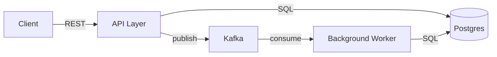

# CODEBASE.md Section Guide

Reference for the `codebase-doc` skill. Read this in full before writing any section.

---

## Section order and rules

Sections are listed in recommended order. Mark optional sections with their condition.
Never include a section you cannot fill with genuine, non-obvious content.

---

### 1. Header block (required)

```markdown
# Codebase Overview

> One-sentence description of what this system does and why it exists.
> Written for a developer encountering the repo cold.

**Last updated:** YYYY-MM-DD  
**Primary language:** [language + version]  
**Architecture style:** [monolith | modular monolith | microservices | library | CLI | serverless]
```

The one-sentence description is the most important line in the file. It anchors every
decision the agent makes. Write it as a capability statement, not a marketing tagline.

Good: `REST API that processes financial transactions and emits audit events to a Kafka topic.`  
Bad: `A modern, scalable backend for financial services.`

---

### 2. Architecture overview (required)

A concise prose description (3–8 sentences) of how the system is structured, followed
by a Mermaid diagram when the system has more than two interacting components.

**Prose covers:**
- What the top-level components/layers are and what each one owns
- How a request or job enters the system and flows through it
- Where state lives (DB, cache, in-memory, file system)
- Any async boundaries (message queues, webhooks, background workers)

**Mermaid diagram rules:**
- Use `graph LR` for dependency/layer diagrams
- Use `sequenceDiagram` for request flows with >3 hops
- Cap at 12 nodes — collapse detail into capability labels, not class names
- Label arrows with the protocol or mechanism (`REST`, `SQL`, `Kafka`, `gRPC`, `import`)



If the project is a **library or CLI** with no networked components, skip the diagram
and describe the public API surface instead.

---

### 3. Tech stack (required)

A compact table. Do not list every dependency — only the load-bearing ones that
meaningfully affect how code is written in this repo.

```markdown
| Layer | Technology | Notes |
|---|---|---|
| Runtime | Python 3.12 | Uses `match` statements throughout |
| Web framework | FastAPI | Pydantic v2 models; async handlers only |
| Database | Postgres 16 | Accessed via SQLAlchemy 2.0 ORM (async) |
| Cache | Redis 7 | Used for rate limiting and session tokens |
| Task queue | Celery + Redis broker | Beat scheduler for periodic jobs |
| Testing | pytest + httpx | Async test client; no Django test client |
| Container | Docker Compose | Three services: app, db, redis |
```

Notes column is where non-obvious constraints live. "Uses Pydantic v2 models" is
useful — it tells the agent not to write v1-style validators. "React" alone is useless.

---

### 4. Entry points (required if non-obvious)

Skip this section if the entry points are obvious from the framework conventions
the agent already knows (e.g. a standard Next.js app with `pages/` or `app/`).

Include it when:
- There are multiple entry points (web server + CLI + worker)
- The entry point is a non-standard file or command
- The startup sequence has side effects an agent needs to know about

```markdown
## Entry Points

| Entry | Command | Purpose |
|---|---|---|
| Web server | `uvicorn app.main:app --reload` | FastAPI app; reads `.env` on startup |
| Worker | `celery -A app.worker worker` | Must start after Redis and DB are ready |
| Migration | `alembic upgrade head` | Run before first server start; idempotent |
| CLI | `python -m app.cli --help` | Admin commands; not for production use |

`app/main.py` registers routers and middleware. Lifespan events in that file initialize
the DB connection pool and load feature flags from Redis.
```

---

### 5. Key modules (required)

The 5–15 most important modules/packages. Not an exhaustive file list — a curated map
of what matters and why.

Format: short table + brief prose for anything that needs a caveat.

```markdown
## Key Modules

| Path | Responsibility |
|---|---|
| `app/api/` | Route handlers. Each file = one domain (users, orders, payments). |
| `app/services/` | Business logic. Handlers must not call the DB directly. |
| `app/models/` | SQLAlchemy ORM models. Source of truth for DB schema. |
| `app/schemas/` | Pydantic request/response models. Separate from ORM models. |
| `app/worker/tasks.py` | All Celery task definitions. |
| `app/core/config.py` | Typed settings class (Pydantic BaseSettings). Loaded once at startup. |
| `tests/` | Test suite. Mirrors `app/` structure. Fixtures in `conftest.py`. |
```

**Danger zones** — files that are risky to modify without understanding their full
effect — should be called out explicitly:

```markdown
> ⚠️ `app/core/middleware.py` — Handles authentication for every request. Changes here
> affect all endpoints. Test with the full integration suite before merging.
```

---

### 6. Data layer (include if project has a DB, cache, or queue)

Describe:
- What schemas/collections exist and their purpose (not field-by-field — link to ORM models)
- Migration strategy (Alembic, Flyway, manual, none)
- Where to find the current schema state
- Any non-obvious data patterns (soft deletes, multi-tenancy via schema-per-tenant, etc.)

```markdown
## Data Layer

**Database:** Postgres. Schema managed by Alembic (`alembic/versions/`).
Run `alembic upgrade head` to apply all migrations.

**Key tables:**
- `users` — Auth identities. Soft-deleted via `deleted_at` timestamp (not hard-deleted).
- `orders` — Append-only. Never update rows; insert new state records instead.
- `audit_log` — Written by DB trigger, not application code. Do not write to directly.

**Cache:** Redis used for two purposes only — rate limiting (key: `rl:{user_id}`) and
session tokens (key: `sess:{token}`). Not used as a primary data store.
```

---

### 7. Non-obvious patterns (highest value section)

This section has the best ROI. Document counterintuitive conventions that will cause
an agent to produce wrong code if it doesn't know about them.

Each entry: one-line pattern name + 2–4 sentence explanation + example if helpful.

```markdown
## Non-Obvious Patterns

**Error handling via Result type, not exceptions**  
Service functions return `Result[T, AppError]` (from the `returns` library) instead of
raising exceptions. Handlers unwrap results and map errors to HTTP status codes.
Never add `try/except` blocks in service layer code — propagate via `Result`.

**All DB access is async**  
The project uses `asyncpg` under SQLAlchemy's async engine. Synchronous SQLAlchemy
sessions will deadlock in FastAPI's event loop. Always use `AsyncSession` and `await`
all DB calls. No sync ORM queries anywhere in the codebase.

**Feature flags loaded at startup, not per-request**  
`app/core/flags.py` loads feature flags from Redis once during the lifespan event.
They are not re-fetched per request. To change a flag in development, restart the server.

**Tests use a real DB, not mocks**  
The test suite spins up a Postgres instance via Docker (see `docker-compose.test.yml`).
There are no mock DB layers. Run `docker compose -f docker-compose.test.yml up -d`
before running `pytest`.
```

---

### 8. Development workflow (required)

Commands to go from clone to running tests. No narrative — pure commands with
inline comments explaining non-obvious steps.

```markdown
## Development Workflow

```bash
# 1. Dependencies
python -m venv .venv && source .venv/bin/activate
pip install -e ".[dev]"

# 2. Infrastructure (Postgres + Redis)
docker compose up -d db redis

# 3. Migrations
alembic upgrade head

# 4. Run dev server
uvicorn app.main:app --reload --port 8000

# 5. Run tests (requires Docker)
docker compose -f docker-compose.test.yml up -d
pytest -x -q
```

**Linting:** `ruff check . && ruff format --check .`  
**Type checking:** `mypy app/`

Environment variables: copy `.env.example` to `.env`. All required vars are listed
in `app/core/config.py` with their types and defaults.
```

---

### 9. CI/CD (include if CI exists)

What the pipeline does and any non-obvious gate behavior.

```markdown
## CI/CD

GitHub Actions (`.github/workflows/`):
- `ci.yml` — runs on every PR: lint → type-check → test. All three must pass.
- `deploy.yml` — runs on merge to `main`: builds Docker image, pushes to ECR,
  triggers ECS rolling deploy. Deploy takes ~4 minutes.

Secrets required: `AWS_ACCESS_KEY_ID`, `AWS_SECRET_ACCESS_KEY`, `ECR_REGISTRY`.
```

---

### 10. Architecture decisions (include if the project has notable constraints)

2–5 decisions that are non-obvious and affect how new code should be written. These
are the "why" behind patterns documented in §7.

```markdown
## Architecture Decisions

**No ORM relationships — explicit joins only**  
SQLAlchemy `relationship()` is not used. All joins are written as explicit SQL via
`select()`. Rationale: avoids N+1 queries from lazy loading in async context.
See `app/repositories/` for examples.

**Single Celery app, multiple queues**  
All async tasks share one Celery app instance but route to different queues by
priority (`high`, `default`, `low`). Do not create additional Celery apps.
```

---

### 11. Glossary (include if the domain uses non-standard terminology)

Only include terms that are genuinely ambiguous or project-specific. Skip if the
domain vocabulary is standard.

```markdown
## Glossary

| Term | Meaning in this codebase |
|---|---|
| **Fulfillment** | The process of reserving inventory and scheduling shipment. Not "completing an order." |
| **Principal** | An authenticated entity (user or API key). Not a financial term here. |
| **Projection** | A read-optimized view of event-sourced state, rebuilt from the event log. |
```

---

### 12. Things to know before changing code (optional, high value)

A short list of gotchas, tripwires, and hidden dependencies. Written as warnings.
If §7 (Non-obvious patterns) already covers these, skip this section.

```markdown
## Before You Change Code

- Changing `app/models/` requires a new Alembic migration. Never edit the DB schema directly.
- The `audit_log` table is populated by a Postgres trigger (`migrations/triggers/audit.sql`).
  Application code must not write to it.
- `app/api/payments.py` calls an external payment provider synchronously. If you add
  retries, add them at the service layer, not the route handler.
- Environment variable names in `.env.example` must stay in sync with `app/core/config.py`
  or startup will fail silently with default values.
```

---

## Monorepo addendum

When the repo contains multiple services or packages, prepend a **Services map** section
immediately after the header block:

```markdown
## Services

| Package | Path | Purpose | Language |
|---|---|---|---|
| `api` | `packages/api/` | Public REST API | TypeScript (Node 22) |
| `worker` | `packages/worker/` | Async job processor | Python 3.12 |
| `web` | `apps/web/` | React frontend | TypeScript |
| `shared` | `packages/shared/` | Shared types and utilities | TypeScript |
```

Then document each service's architecture individually under `##` headings, or link
to per-package `CODEBASE.md` files if the monorepo is large.

---

## Tone and style rules

- Write in present tense: "The service exposes..." not "The service will expose..."
- Prefer active voice: "Handlers call services" not "Services are called by handlers"
- Use second person sparingly: "Run `pytest`" not "You should run `pytest`"
- No marketing language: no "powerful", "modern", "scalable", "robust"
- Abbreviations: spell out on first use, then abbreviate
- Headings: sentence case, not title case ("Non-obvious patterns", not "Non-Obvious Patterns")
